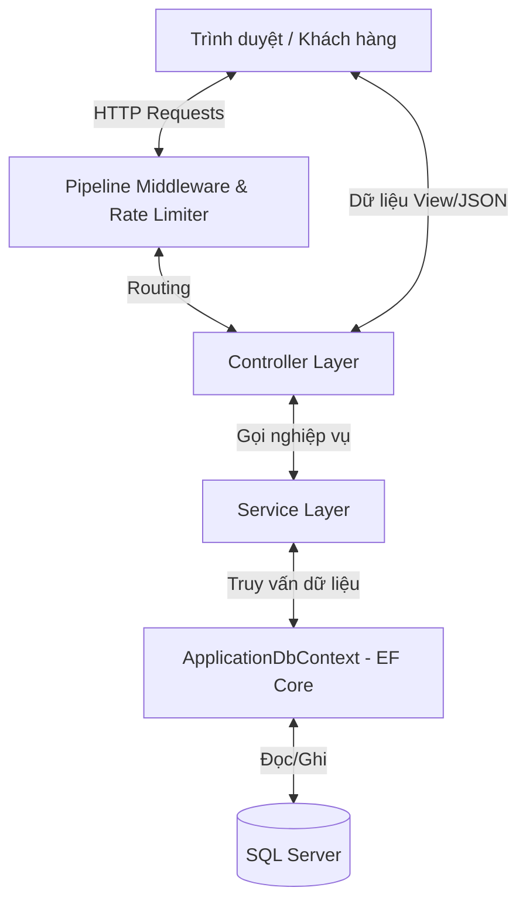
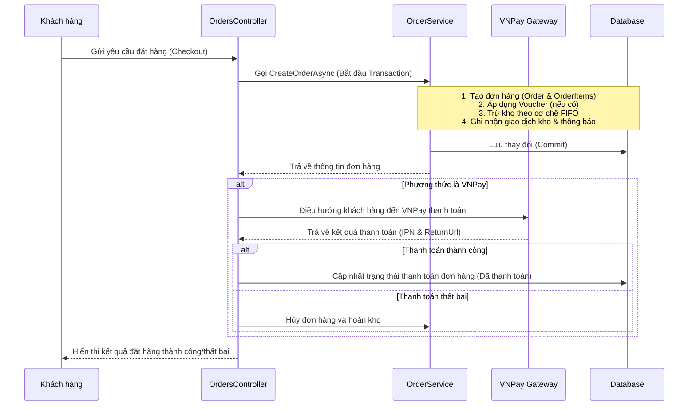

# Hướng Dẫn Vận Hành & Cách Hoạt Động Của Hệ Thống ClothingShop

Tài liệu này giải thích chi tiết về kiến trúc, cấu trúc thư mục, luồng xử lý nghiệp vụ chính và các công nghệ được áp dụng trong ứng dụng e-commerce bán quần áo **ClothingShop**.

---

## 1. Tổng Quan Kiến Trúc & Công Nghệ

Hệ thống được phát triển theo mô hình **MVC (Model-View-Controller)** truyền thống của ASP.NET Core, kết hợp thêm lớp **Services (Nghiệp vụ dịch vụ)** để tách biệt phần xử lý logic kinh doanh khỏi Controller.

### Công nghệ cốt lõi:
*   **Backend Framework:** ASP.NET Core MVC (C#).
*   **Database:** Microsoft SQL Server.
*   **ORM:** Entity Framework Core (EF Core) hoạt động theo cơ chế **Code-First**.
*   **Xác thực (Authentication):** Cookie-based Authentication (`CookieAuthenticationDefaults`).
*   **Mã hóa:** `BCrypt.Net` cho mật khẩu của người dùng.
*   **Tích hợp bên thứ ba:**
    *   **Thanh toán:** Cổng thanh toán trực tuyến **VNPay**.
    *   **Email:** Gửi thông tin đơn hàng/khôi phục mật khẩu thông qua SMTP.
*   **Bảo mật:** `AspNetCoreRateLimit` giới hạn tần suất gửi yêu cầu để chống spam/DDoS.

---

## 2. Cấu Trúc Thư Mục Dự Án

Thư mục chính chứa mã nguồn là [ClothingShop](file:///d:/tmdt/ClothingShop/):

*   [Controllers](file:///d:/tmdt/ClothingShop/Controllers/): Tiếp nhận các yêu cầu HTTP từ client, điều hướng và trả về View (HTML) hoặc dữ liệu JSON.
    *   Thư mục con [Controllers/Admin](file:///d:/tmdt/ClothingShop/Controllers/Admin/): Chứa các controller dành riêng cho các chức năng quản trị viên như quản lý kho, sản phẩm, báo cáo doanh thu.
*   [Models](file:///d:/tmdt/ClothingShop/Models/): Định nghĩa các thực thể (Entities) ánh xạ trực tiếp xuống cơ sở dữ liệu và các ViewModel để truyền dữ liệu.
*   [Views](file:///d:/tmdt/ClothingShop/Views/): Chứa các tệp Razor View (`.cshtml`) làm giao diện HTML phía client.
*   [Services](file:///d:/tmdt/ClothingShop/Services/): Chứa các lớp xử lý logic nghiệp vụ chính (Business Logic Layer) như xử lý đơn hàng, giỏ hàng, gửi email và tích hợp VNPay.
*   [Data](file:///d:/tmdt/ClothingShop/Data/): Chứa lớp [ApplicationDbContext.cs](file:///d:/tmdt/ClothingShop/Data/ApplicationDbContext.cs) để thiết lập ánh xạ cơ sở dữ liệu và cấu hình Fluent API.
*   `wwwroot`: Chứa các tài nguyên tĩnh như CSS, JS, hình ảnh sản phẩm.

---

## 3. Các Mô Hình Thực Thể Quan Trọng (Data Models)

Hệ thống quản lý dữ liệu chặt chẽ qua các thực thể trong [Models](file:///d:/tmdt/ClothingShop/Models/):
1.  **[User.cs](file:///d:/tmdt/ClothingShop/Models/User.cs):** Lưu trữ thông tin người dùng bao gồm thuộc tính phân quyền `IsAdmin`.
2.  **[Product.cs](file:///d:/tmdt/ClothingShop/Models/Product.cs) & [ProductCategory.cs](file:///d:/tmdt/ClothingShop/Models/ProductCategory.cs):** Quản lý thông tin chung về sản phẩm và phân loại danh mục.
3.  **[ProductVariant.cs](file:///d:/tmdt/ClothingShop/Models/ProductVariant.cs):** Quản lý thuộc tính chi tiết của sản phẩm theo từng cặp Kích thước (`Size`) và Màu sắc (`Color`). Mỗi biến thể có số lượng tồn kho và giá tiền riêng.
4.  **[ProductVariantBatch.cs](file:///d:/tmdt/ClothingShop/Models/ProductVariantBatch.cs):** Lưu thông tin các lô hàng nhập kho của từng biến thể (Giá nhập, số lượng nhập ban đầu, số lượng còn lại) để phục vụ cho cơ chế FIFO.
5.  **[InventoryTransaction.cs](file:///d:/tmdt/ClothingShop/Models/InventoryTransaction.cs):** Theo dõi lịch sử xuất/nhập kho chi tiết của từng sản phẩm.
6.  **[Order.cs](file:///d:/tmdt/ClothingShop/Models/Order.cs) & [OrderItem.cs](file:///d:/tmdt/ClothingShop/Models/OrderItem.cs):** Thông tin chi tiết về đơn đặt hàng và các mặt hàng trong đơn hàng.
7.  **[Voucher.cs](file:///d:/tmdt/ClothingShop/Models/Voucher.cs) & [VoucherUsage.cs](file:///d:/tmdt/ClothingShop/Models/VoucherUsage.cs):** Quản lý các chương trình mã giảm giá và lịch sử áp dụng mã của người dùng.

---

## 4. Các Luồng Hoạt Động Chính (Core Workflows)

### 4.1. Luồng Xác Thực & Phân Quyền (Authentication)
*   Hệ thống sử dụng **Cookie Authentication** được đăng ký tại [Program.cs](file:///d:/tmdt/ClothingShop/Program.cs).
*   Khi người dùng đăng nhập thành công qua [AccountController.cs](file:///d:/tmdt/ClothingShop/Controllers/AccountController.cs), một Cookie chứa các Claims (Họ tên, Vai trò Admin/User) sẽ được lưu lại ở trình duyệt khách hàng.
*   Khi truy cập vào các đường dẫn quản trị, thuộc tính `[Authorize(Roles = "Admin")]` sẽ kiểm tra Cookie của người dùng xem có quyền admin hay không. Nếu không, người dùng sẽ bị điều hướng sang trang từ chối truy cập.

### 4.2. Luồng Giỏ Hàng (Cart Workflow)
*   Khi người dùng thêm sản phẩm vào giỏ hàng, thông tin được xử lý bởi [CartService.cs](file:///d:/tmdt/ClothingShop/Services/CartService.cs) lưu trữ trực tiếp vào bảng `Carts` trong CSDL liên kết với `UserId` của tài khoản đang đăng nhập.
*   Thông tin giỏ hàng được kiểm tra tính duy nhất theo nhóm: `UserId + ProductId + Size + Color`. Nếu sản phẩm có cùng size và màu sắc đã tồn tại, hệ thống chỉ cộng dồn số lượng.

### 4.3. Luồng Đặt Hàng & Thanh Toán (Order & Payment Workflow)

Quy trình thanh toán được thực hiện an toàn qua Database Transaction như sau:

### 4.4. Cơ Chế Trừ Kho FIFO (First In, First Out)
Khi đặt hàng thành công, hệ thống sẽ thực hiện trừ tồn kho của biến thể sản phẩm theo nguyên tắc **Nhập trước - Xuất trước**:
1.  Hệ thống tìm kiếm các lô hàng nhập (`ProductVariantBatch`) của biến thể sản phẩm đó có `RemainingQuantity > 0`, sắp xếp theo thời gian tạo cũ nhất (`CreatedAt`).
2.  Trừ số lượng cần bán từ lô cũ nhất. Nếu lô cũ nhất không đủ số lượng, hệ thống sẽ trừ tiếp vào các lô tiếp theo cho đến khi đủ số lượng yêu cầu.
3.  Tính toán **Giá vốn bình quân FIFO** (`Cost`) cho sản phẩm bán ra dựa trên giá nhập của các lô đã trừ. Lượng thông tin này lưu tại `OrderItem.Cost` phục vụ cho việc tính toán lợi nhuận chính xác.
4.  Cập nhật tổng số lượng tồn của `ProductVariant` và ghi nhật ký xuất kho vào `InventoryTransaction`.

### 4.5. Cơ Chế Hoàn Kho Khi Hủy Đơn Hàng
Khi một đơn hàng bị hủy (khách hàng tự hủy hoặc admin hủy do thanh toán không thành công):
1.  Hệ thống cập nhật trạng thái đơn hàng thành `Đã hủy`.
2.  Hoàn trả số lượng sản phẩm của từng mặt hàng về kho biến thể `ProductVariant.Quantity`.
3.  Hoàn trả số lượng vào **Lô hàng mới nhất** (`ProductVariantBatch`) để tiếp tục bán hoặc tạo một lô hoàn trả dạng `REFUND-[#Mã_đơn_hàng]` nếu không tìm thấy lô cũ.
4.  Ghi nhận giao dịch nhập kho vào bảng `InventoryTransaction` để đối soát kho chính xác.
5.  Xóa bản ghi lịch sử sử dụng voucher (`VoucherUsage`) để hoàn lại quyền sử dụng voucher cho khách hàng.

---

## 5. Phân Hệ Quản Trị Kho Hàng (Inventory Control)
Quản trị viên quản lý kho hàng tập trung thông qua [InventoryController.cs](file:///d:/tmdt/ClothingShop/Controllers/Admin/InventoryController.cs):
*   **Cảnh báo hết hàng:** Hệ thống lọc ra danh sách các biến thể có số lượng tồn kho dưới ngưỡng tối thiểu để admin kịp thời nhập thêm.
*   **Nhập kho theo lô:** Khi nhập thêm hàng, admin điền số lượng, giá nhập và mã lô. Hệ thống sẽ tạo bản ghi `ProductVariantBatch` mới phục vụ cho luồng tính giá vốn FIFO.
*   **Điều chỉnh kho (Write-off):** Cho phép xuất kho các sản phẩm bị lỗi hỏng, rách hoặc mất mát và ghi nhận lý do điều chỉnh cụ thể.

---

## 6. Phân Hệ Báo Cáo & Phân Tích (Analytics & Reports)
Được triển khai tại [ReportsController.cs](file:///d:/tmdt/ClothingShop/Controllers/Admin/ReportsController.cs), hệ thống tổng hợp dữ liệu thời gian thực:
*   **Báo cáo doanh thu & Lợi nhuận:** Tính tổng doanh thu từ các đơn hàng thành công, trừ đi tổng giá vốn (tính theo FIFO) để đưa ra chỉ số lợi nhuận gộp chính xác.
*   **Sản phẩm bán chạy:** Liệt kê các sản phẩm có số lượng bán cao nhất trong khoảng thời gian xác định.
*   **Xuất bản báo cáo:** Hỗ trợ kết xuất dữ liệu báo cáo ra các định dạng bảng biểu giúp nhà quản trị dễ dàng lưu trữ và đánh giá.
